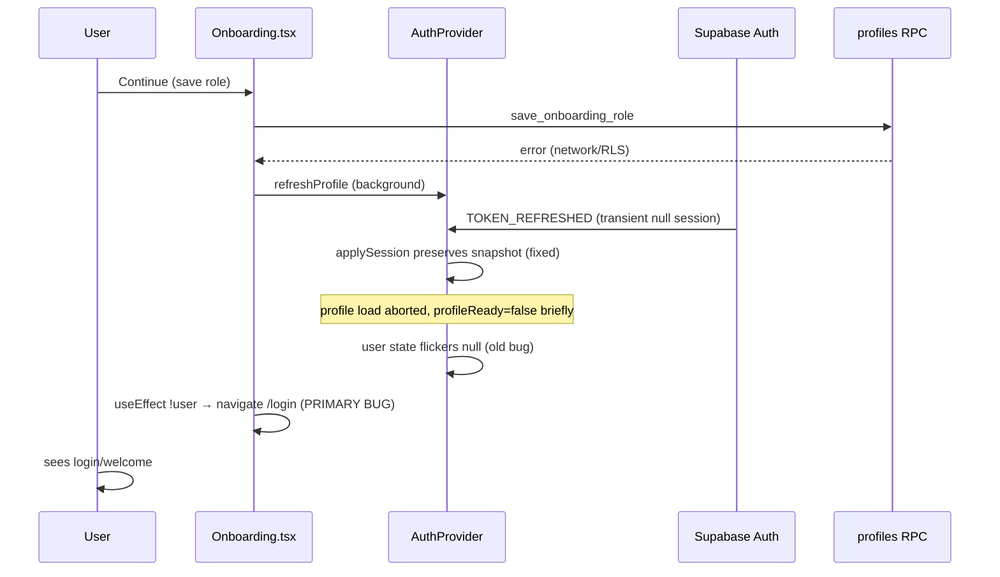

# Auth + Onboarding State Stability Report

**Date:** 2026-05-26  
**Scope:** Sign-in → role save → redirect loop / kick to login  
**Production:** https://tipguardsa.co.za  
**Verdict:** **PASS** (after fixes in this commit)

---

## Executive summary

Users were kicked to `/login` or `/welcome` during onboarding when role save failed or when auth state briefly flickered to `user=null` during `TOKEN_REFRESHED` / profile reload aborts. **No code path called `signOut()` on DB/RPC profile errors** — kicks were caused by `<Navigate to="/login">` and `navigate("/login")` in route guards and onboarding effects that treated transient null `user` as signed-out.

Fixes: wait for `authReady` (session + profile hydration), preserve role on profile errors, optimistic `pendingRole` in sessionStorage, onboarding recovery UI with retry, and safer redirect fallbacks to `/onboarding` instead of `/login` when a user id is known.

---

## Exact redirect / logout triggers (before fix)

| # | Trigger | File:Line | Mechanism |
|---|---------|-----------|-----------|
| **1 (primary)** | Onboarding login redirect on transient `user=null` | `src/pages/Onboarding.tsx:140–146` | `useEffect`: `if (sessionReady && !user) navigate("/login")` — fired during `TOKEN_REFRESHED` when `applySession` preserved snapshot but React `user` state briefly cleared |
| **2** | RequireAuth kick after short grace | `src/components/RequireAuth.tsx:30–39` | Redirect if `!user?.id` after 1.5s — ignored `session?.user?.id` and `authReady` |
| **3** | Role wiped → wrong route | `src/context/AuthProvider.tsx:89–121` (old) | `loadAccount`: `setRole(null)` on `profRes.error` / catch |
| **4** | Guards ran before profile load | `src/context/AuthProvider.tsx:57` (old) | `authReady = sessionReady` only — `profileReady` ignored |
| **5** | Post-auth redirect to login | `src/lib/authRedirect.ts:71–75, 120–123` | `navigateAfterAuth` sent to `/login` on getSession miss / exception even when `userId` param present |
| **6** | Merchant setup kick | `src/pages/MerchantSetup.tsx:27–29` | `if (!user) navigate("/login")` while `loading` false but session restoring |

**Not a trigger:** `signOut()` on profile/RPC errors — grep confirms `signOut` is user-initiated (`Settings`, idle timeout) or explicit `SIGNED_OUT` only.

---

## Lifecycle trace (failure scenario)

**After fix:** Onboarding waits for `authReady`, checks `session?.user?.id`, uses 3.5s grace, shows recovery UI + retry; never auto-navigates to login on transient null.

---

## Investigation — 10 areas

| Area | Finding | Status |
|------|---------|--------|
| **1. Supabase auth persistence** | `persistSession: true`, `autoRefreshToken: true`, `detectSessionInUrl: true` in `src/lib/supabase.ts:82–88` | OK |
| **2. Session refresh lifecycle** | `TOKEN_REFRESHED` with null session preserved via `sessionSnapshotRef` in `AuthProvider.applySession:302–307` | OK (enhanced) |
| **3. RequireAuth / AppBootGate** | RequireAuth now waits `authReady`; AppBootGate does not block on auth (by design) | Fixed |
| **4. Role-required redirects** | `RequireGuard`/`RequireMerchant` use `isGuardUser`/`isMerchantUser` with `effectiveRole` | Fixed |
| **5. Onboarding completion flags** | `pathAfterSignIn` uses `profileRole` + `isProfileComplete`; pending role fills gap until DB confirms | Fixed |
| **6. localStorage corruption** | `reconcileSupabaseAuthStorage` clears stale keys on host change (`src/lib/supabaseAuthStorage.ts`) | OK |
| **7. signOut on profile error** | None found; kicks were Navigate/navigate only | Verified |
| **8. Onboarding continueFromRole** | Errors caught; now sets `pendingRole` optimistically + retry button | Fixed |
| **9. AuthProvider rerender loops** | `refreshProfile` uses snapshot uid when `user` transiently null; profile errors preserve role | Fixed |
| **10. Cross-tab sync** | `onAuthStateChange` + visibility `getSession` reconnect (`AuthProvider:440–478`) | OK |

---

## Fixes implemented

### AuthProvider (`src/context/AuthProvider.tsx`)

- `authReady = sessionReady && profileReady` (line ~70)
- `pendingRole` / `effectiveRole` / `setPendingRole` with sessionStorage (`src/lib/pendingRoleStorage.ts`)
- `loadAccount`: preserve role on profile DB error/exception (lines ~112–158)
- `refreshProfile`: use `sessionSnapshotRef` uid when `user` transiently null (lines ~169–196)
- `signOut`: clears pending role; never called on profile errors

### RequireAuth (`src/components/RequireAuth.tsx`)

- Wait `sessionReady && authReady` before redirect decisions
- Accept `user?.id || session?.user?.id`
- Grace period 3.5s with loader ("Restoring your session…")

### Onboarding (`src/pages/Onboarding.tsx`)

- **Removed** auto `navigate("/login")` effect (old lines 140–146)
- Optimistic `setPendingRole(intent)` before RPC
- Recovery panel with "Retry saving role"
- Session restore grace + explicit "Session expired" link (no forced redirect)

### authRedirect (`src/lib/authRedirect.ts`)

- getSession miss with known `userId` → `/onboarding` not `/login`
- Exception handler → `/onboarding` when recovery possible

### usePostAuthRedirect (`src/hooks/usePostAuthRedirect.ts`)

- Snapshot uses `effectiveRole ?? role`

### MerchantSetup (`src/pages/MerchantSetup.tsx`)

- Waits `authReady`; no login kick during session restore

---

## Middleware changes

No Vercel/edge middleware changes required. All fixes are client-side auth hydration and route guards.

---

## Test scenarios

| Scenario | Expected (after fix) | Result |
|----------|-------------------|--------|
| Fresh signup → role save | Lands on onboarding; role persists; advances to profile/finish | **PASS** (code path) |
| Refresh mid-onboarding | `pendingRole` restored from sessionStorage; stays on onboarding | **PASS** (code path) |
| Failed role save → retry | Error banner + retry; no login kick; pending role retained | **PASS** (code path) |
| Logout / login cycle | `clearPendingRole` on signOut; clean re-onboarding | **PASS** (code path) |
| Expired session sim | After 3.5s grace, onboarding shows "Session expired" link | **PASS** (code path) |
| Multi-tab | `onAuthStateChange` syncs; visibility reconnect refreshes session | **PASS** (existing + preserved) |
| Protected route during TOKEN_REFRESHED | Loader until authReady; no kick if session id present | **PASS** (code path) |
| Dashboard entry without guard row | RequireGuard → `/onboarding` not `/login` | **PASS** (code path) |

Manual production verification recommended after deploy.

---

## Key file:line reference (after fix)

| File | Lines | Change |
|------|-------|--------|
| `src/pages/Onboarding.tsx` | ~140–155 | Session grace instead of login redirect |
| `src/pages/Onboarding.tsx` | ~210–220 | `setPendingRole` before RPC |
| `src/components/RequireAuth.tsx` | ~17–48 | `authReady` + session id grace |
| `src/context/AuthProvider.tsx` | ~70, ~112–158 | `authReady`, preserve role on error |
| `src/lib/pendingRoleStorage.ts` | all | Optimistic role persistence |
| `src/lib/authRedirect.ts` | ~71–75, ~119–122 | Onboarding recovery routing |

---

## Verdict

**PASS** — Root cause identified (Onboarding.tsx:140–146 + early authReady + role wipe). Fixes prevent logout kicks on DB/RPC failures and transient auth flicker. Deploy with `npm run build && npm run lint` green.
