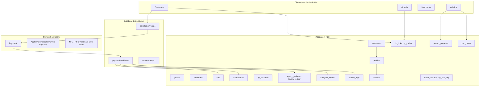

# TipGuard SA — ecosystem architecture map

This document describes how the platform fits together for **production scale in South Africa**, payment rails (Paystack today; Yoco / Ozow / tap-to-pay later), and future **YieldCore AI** consumption of the same event spine.

## System map

## Major subsystems (lead-architect view)

| Subsystem | Responsibility | Primary surfaces |
|-----------|----------------|-------------------|
| **Identity** | Supabase Auth + `profiles` (role, Paystack customer ref, referral code). Triggers block privilege escalation. | Login, session refresh, MFA-ready hooks in Edge. |
| **Parties** | `guards`, `merchants`, `customers` — operational entities with RLS scoped to owner or admin. | GuardHome, MerchantDashboard, onboarding flows. |
| **Money path** | `tips` + `finalize_tip_from_paystack_reference` (atomic credit to guard). `transactions` for payer ledger. `customer_wallets` for top-ups. | Checkout metadata `type: guard_tip` / `wallet_topup`. |
| **Settlement hooks** | `post_tip_settlement_hooks(reference)` — idempotent loyalty, `analytics_events`, `activity_logs` after Paystack `charge.success`. | `paystack-webhook` (service role). |
| **Loyalty** | `loyalty_wallets` + append-only `loyalty_ledger`; ZA calendar day streak (`Africa/Johannesburg`). | Customer retention; future redemption catalog. |
| **Referrals** | Immutable `profiles.referral_code`; `referrals` one row per referee; `register_referral_attribution` (service only). | Auth callback Edge or signup function. |
| **KYC** | `kyc_cases` per guard/merchant/user; draft → submitted → admin review. | Compliance, underwriting, merchant onboarding. |
| **Analytics** | `analytics_events` append-only; admin-readable; feeds BI / YieldCore batch jobs via export or replica. | Product metrics, fraud modelling. |
| **Fraud & abuse** | `fraud_events`, `api_rate_log`, webhook idempotency (`paystack_webhook_events`). | Rate limits in initialize; manual admin review. |
| **QR / deep links** | `tip_links`, `resolve_tip_link`, `touch_tip_link`, `tip_sessions.public_token`. | `/t/:token`, Guard QR screen. |
| **NFC / RFID prep** | `rfid_tags` (existing), `tip_sessions.payment_surface` (`nfc_preparing`, `rfid`, wallet rails). | Hardware binding in a later Edge + device registry migration. |
| **Payouts** | `payout_requests` + admin state machine + future batched EFT. | Guard cash-out; treasury controls. |

## API structure (logical)

| Layer | Mechanism | Notes |
|-------|-----------|-------|
| **Data API** | PostgREST (Supabase auto REST) + RLS | Browser uses **anon / user JWT** only. |
| **RPC** | `security definer` functions with explicit auth checks | Public guard listing, tip session creation, admin metrics. |
| **Edge** | Service role for webhooks, payouts, Paystack init | **Never** expose service key to Vite. |
| **Future** | YieldCore webhooks or read replica | Subscribe to `analytics_events` / warehouse export. |

See [API_SURFACE.md](./API_SURFACE.md) for function and Edge inventory.

## Security invariants

1. **No ledger writes from the browser** for tips, guard balances, merchant verification, or Paystack subaccount codes.  
2. **Webhooks** verify HMAC (Paystack) before any mutation.  
3. **Idempotency** on webhook keys and loyalty `ref_tip_id` dedupe.  
4. **RLS** defaults deny; admin paths use `is_admin()`; service role bypasses RLS for settlement only.

## Scaling posture (South Africa)

- **Postgres**: indexed hot paths (`tips`, `transactions`, `analytics_events`, `loyalty_ledger`).  
- **Edge**: stateless handlers; scale with Supabase / regional placement.  
- **Read models**: `tip_transactions` view; add materialized views later for merchant analytics.  
- **Compliance**: POPIA — minimize PII in `analytics_events.properties`; hash device identifiers at Edge before insert.
