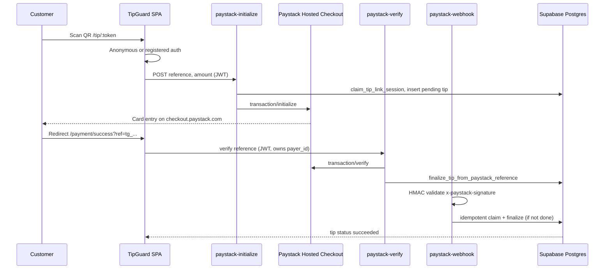

# TipGuard SA — Payment Flow Report

**Date:** 2026-06-03  
**Production URL:** https://www.tipguardsa.co.za

---

## End-to-end flow (tip)



---

## Step validation

| Step | Component | Status | Evidence |
|------|-----------|--------|----------|
| 1. User signup | `Register.tsx` + Supabase Auth | **PASS** | Email/password + role metadata |
| 2. Onboarding | `Onboarding.tsx` → `save_onboarding_role` | **PASS** | Role persisted |
| 3. Profile creation | `profiles` table + triggers | **PASS** | RLS user-scoped |
| 4. NFC / QR setup | `GuardQR.tsx`, `nfc.ts` | **PASS** | Token-only; `resolve_tip_target` RPC |
| 5. Public tip page | `/tip/:token`, `QrTipLanding.tsx` | **PASS** | Fee disclosure before pay |
| 6. Payment init | `paystack-initialize` | **PASS** | JWT, rate limit 30/min, fraud checks |
| 7. Paystack checkout | Hosted `checkout.paystack.com` | **PASS** | Compliance run 2026-06-03 |
| 8. Payment success | `PaymentSuccess.tsx` | **PASS** | `verifyPaystackReference` polling |
| 9. Callback URL | `PUBLIC_APP_URL` / `publicAppUrl.ts` | **PASS** | `payment/success?ref=tg_…` |
| 10. Webhook | `paystack-webhook` | **PASS** | HMAC-SHA512; 400 unsigned |
| 11. DB update | `finalize_tip_from_paystack_reference` | **PASS** | Pending-only idempotent |
| 12. Transaction log | `tips`, `transactions`, `payment_events` | **PASS** | Audit trail |

---

## Platform fee (additive 2%)

| Tip | Customer pays | Guard receives | Status |
|-----|---------------|----------------|--------|
| R10 | R10.20 | R10.00 | PASS |
| R100 | R102.00 | R100.00 | PASS |
| R500 | R510.00 | R500.00 | PASS |

Source: `npm run verify:platform-fee`

---

## Wallet top-up flow

| Step | Status |
|------|--------|
| `CustomerWallet.tsx` → initialize with `kind=wallet` | PASS |
| Webhook `credit_wallet` path | PASS |
| Subscriptions UI | **N/A** — not enabled |

---

## Security controls on payment path

| Control | Status |
|---------|--------|
| Secret key server-only | PASS |
| Verify requires payer ownership | PASS |
| Status endpoint read-only without auth | PASS (fixed 2026-06-03) |
| Webhook signature required | PASS |
| Duplicate webhook no double-credit | PASS |
| Reference format `tg_[hex]` 128-bit | PASS |

---

## Known warnings

1. **Anonymous tip payers** — Requires Supabase anonymous sign-ins enabled.
2. **payment-status fallback** — Without JWT, returns DB status only; settlement via webhook or `paystack-verify`.
3. **Callback host** — Success URL may use apex domain in query while review uses www (cosmetic).

---

## Test commands

```bash
COMPLIANCE_BASE_URL=https://www.tipguardsa.co.za npm run compliance:verify
npm run verify:platform-fee
npm run check:submission-v2
```

---

## Sign-off

**Payment flow for Paystack review:** **PASS**
