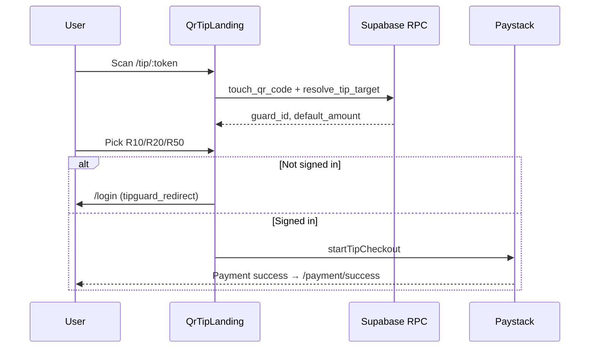

# Payment + QR architecture (TipGuard SA)

Production-oriented payment and QR flow for mobile tipping, merchant operations, and admin analytics.

## Routes

| Path | Purpose |
|------|---------|
| `/tip/:token` | Mobile QR landing (`QrTipLanding`) — presets R10/R20/R50, Paystack checkout |
| `/t/:token` | Legacy redirect → `/tip/:token` |
| `/customer/tip/:guardId` | Authenticated in-app checkout (`TipCheckout`) |
| `/merchant/locations` | Merchant site management |
| `/merchant/guards` | Merchant guard roster |
| `/admin/analytics` | `admin_payment_analytics` RPC dashboard |

## Database (`20260622100000_payment_qr_production.sql`)

- **`merchant_locations`** — sites under a merchant; RLS by `merchant_id`
- **`guards`** — `merchant_id`, `location_id` for multi-site venues
- **`qr_codes`** — `location_id`, `default_amount_cents`, scan counts
- **`payment_events`** — idempotent provider webhooks via `claim_provider_webhook_event()`
- **RPCs**
  - `resolve_tip_target(p_token)` — QR code first, then `tip_links`
  - `admin_payment_analytics()` — admin-only JSON metrics
  - `merchant_payment_analytics()` — merchant-scoped volume

Apply on staging:

```bash
supabase db push
# or
supabase migration up
```

## Payment adapters

| Provider | Client registry | Edge webhook | Status |
|----------|-----------------|--------------|--------|
| Paystack | Live (`paystack`) | `paystack-webhook` | Production |
| PayFast | Planned | TBD | Stub |
| Yoco | Planned | TBD | Stub |
| Ozow | Planned | TBD | Stub |

Configure `VITE_TIP_PAYMENT_GATEWAY=paystack` (default). See `.env.example` and `src/payments/registry.ts`.

## QR → pay flow



## Deployment (Vercel)

1. Set `VITE_SUPABASE_URL`, `VITE_SUPABASE_ANON_KEY`, `VITE_PAYSTACK_PUBLIC_KEY`
2. Set `PUBLIC_APP_URL` in Supabase secrets for Paystack callbacks
3. Register Paystack webhook → `https://<project>.supabase.co/functions/v1/paystack-webhook`
4. Run migration before enabling `/tip/:token` in production QR prints

## Blockers before full multi-gateway

- PayFast / Yoco / Ozow Edge Functions and webhook secrets
- `payment_events` logging from `paystack-webhook` (schema ready)
- Merchant guard QR creation from `/merchant/guards` (links to `/guard/qr` for guard-owned accounts)
- POPIA retention policy for `payment_events` payloads

## Related docs

- [ECOSYSTEM_ARCHITECTURE.md](./ECOSYSTEM_ARCHITECTURE.md)
- [DEPLOYMENT_CHECKLIST.md](./DEPLOYMENT_CHECKLIST.md)
- [API_SURFACE.md](./API_SURFACE.md)
