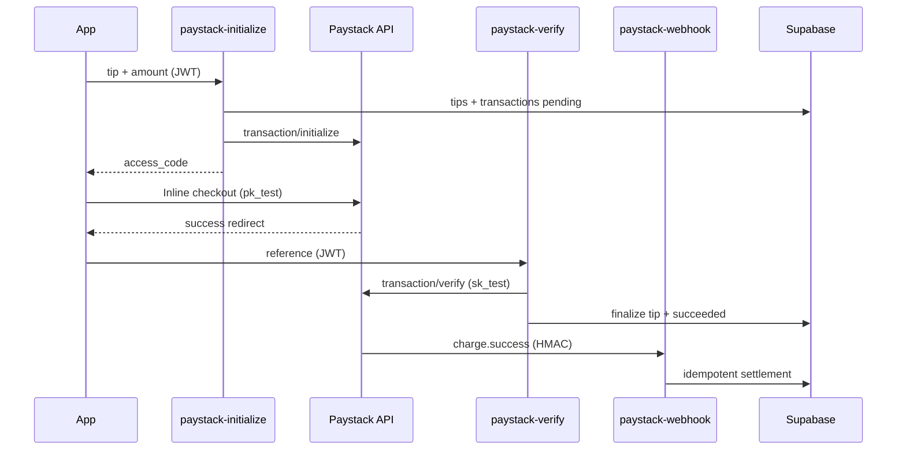

# Paystack integration (test mode)

## Environment separation

| Variable | Where | Purpose |
|----------|--------|---------|
| `VITE_PAYSTACK_PUBLIC_KEY` | Vercel / `.env` (client) | Paystack Inline checkout UI |
| `PAYSTACK_SECRET_KEY` | **Supabase Edge secrets only** | Initialize + verify + webhook |
| `PUBLIC_APP_URL` | Supabase Edge secrets | Paystack `callback_url` after payment |
| `VITE_PAYSTACK_TEST_MODE` | Client (optional) | Test banner; inferred from `pk_test_` |

**Never** put `sk_test_*` or `sk_live_*` in `VITE_*` or commit real secrets.

## Flow



## Edge functions

Deploy after setting secrets:

```bash
npx supabase secrets set PAYSTACK_SECRET_KEY=sk_test_xxx PUBLIC_APP_URL=https://your-app.vercel.app
npx supabase functions deploy paystack-initialize paystack-verify paystack-webhook
```

Register webhook in Paystack Dashboard:

`https://fyjmujhlqpvfryelnfum.supabase.co/functions/v1/paystack-webhook`

## Test card

- Number: `4084084084084081`
- CVV: `408`
- Expiry: any future date

## Client routes

- Success: `/payment/success?ref=…` (polls `paystack-verify` until confirmed)
- Failure: `/payment/failure?reason=…`
- History: `/customer/transactions`
