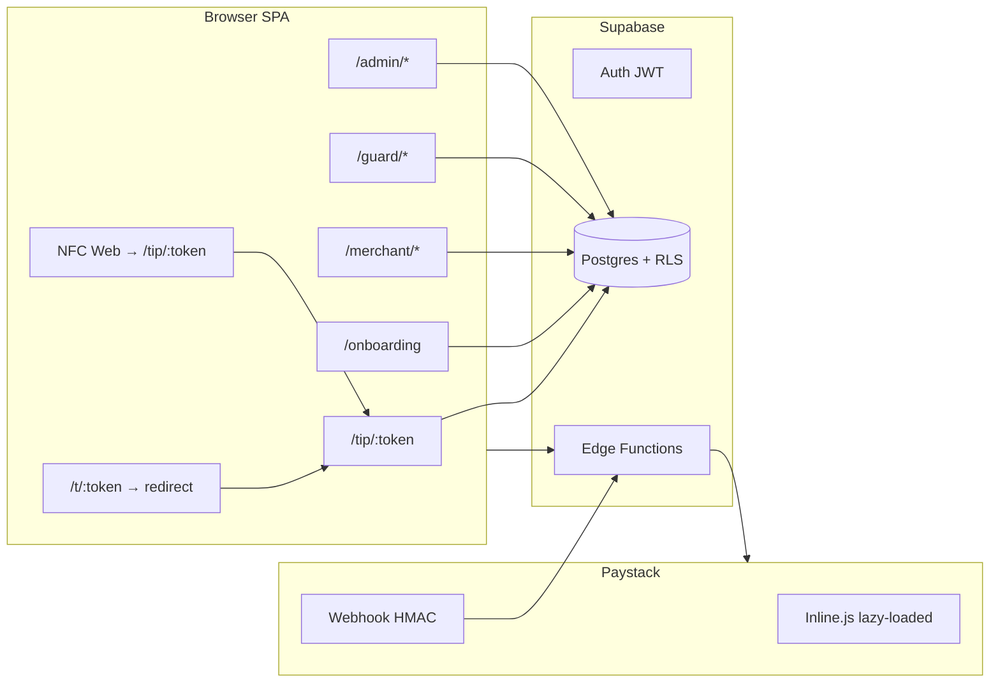

# TipGuard SA — Pre-launch platform architecture (roadmap)

**Status:** Living document — distinguishes **shipped** vs **planned**. Not a claim that every vision item is built.  
**Production:** https://tipguardsa.co.za · **Stack:** Vite/React SPA, Supabase (Auth/Postgres/RLS/Edge), Paystack (ZAR), Vercel.

---

## 1. Product layers (as built today)

| Layer | Shipped | Notes |
|-------|---------|-------|
| **QR redirect** | Yes | `/t/:token` → `/tip/:token` (`TipResolve.tsx`). QR URLs use app origin, not Paystack. |
| **NFC redirect** | Partial | Web NFC → `/tip/{token}` or `/customer/tip/{guard_id}`. No NTAG provisioning UI (future). |
| **Tip checkout** | Yes | `QrTipLanding` → `paystack-initialize` → lazy `js.paystack.co` inline. |
| **Auth / onboarding** | Yes | 3-step onboarding; merchant fail-safe to `/merchant/setup` (`fbc0662`). |
| **Merchant hub** | Yes | Dashboard, setup, locations, QR print, guards list, KYC placeholder page. |
| **Guard hub** | Yes | Wallet, payouts request, QR, history. |
| **Admin** | Yes | Dashboard, transactions, fraud, security, metrics — not a full analytics rebuild. |
| **Customer** | Yes | Browse guards (RPC), wallet top-up, transactions. |

---

## 2. Fee model (platform commission)

| Item | Implementation |
|------|----------------|
| **Source of truth** | `platform_settings.fee_bps` + `get_platform_fee_bps()` (SQL, security definer). |
| **Applied at** | `paystack-initialize` Edge only — `commission_cents = round(amount_cents * fee_bps / 10000)`. |
| **Client** | **No** fee calculation — analytics may *display* `commission_cents` from RPC responses only. |
| **Default seed** | `250` bps (2.5%) in migrations — **vision target 2% = `200` bps** via operator update: `update platform_settings set fee_bps = 200 where id = 1;` |
| **Settlement** | Webhook + `post_tip_settlement_hooks` (DB) on success. |

---

## 3. Redirect & analytics (non-blocking)

- `resolve_tip_target` runs **first**; `touch_tip_link` / `touch_qr_code` fire-and-forget after success (`4124eeb`).
- No hardcoded Paystack URLs on QR/NFC paths (Paystack script only at checkout).
- Scan analytics stored server-side via touch RPCs.

---

## 4. Security baseline (shipped)

| Control | Migration / code |
|---------|------------------|
| `platform_settings` RLS | `20260626170000_security_hardening_rls.sql` |
| Anon revoke sensitive RPCs | Same migration (public tip RPCs remain) |
| Webhook HMAC SHA-512 | `paystack-webhook/index.ts` (`x-paystack-signature`) |
| Secrets | `PAYSTACK_SECRET_KEY`, service role — Supabase secrets only |
| Client bundle | `scan:secrets` / readiness — no `service_role` in `src/` |

---

## 5. Feature matrix (honest)

| Capability | Merchant | Guard | Admin | Customer |
|------------|----------|-------|-------|----------|
| Onboarding / role | Yes | Yes | N/A | Yes |
| QR / tip links | Yes | Yes | View txs | Tip via QR |
| Paystack checkout | Via guard QR path | Receive | N/A | Yes |
| Payout request | Venue prefs | Yes | Approve RPC | N/A |
| Analytics v2 RPC | Dashboard panel | Sparkline | Admin RPCs | History |
| KYC upload | Placeholder page | Verification badge | Fraud tools | N/A |
| Subscriptions | — | — | — | **Future** |
| Multi-region / white-label | — | — | — | **Future** |
| POS integration | — | — | — | **Future** |
| AI risk / support | — | — | **Future** | — |

---

## 6. Performance (4124eeb — retained)

- Auth: single profile load on boot; coalesced `refreshProfile`.
- Guard dashboard: parallel queries, narrow `select`.
- Lazy route chunks; Sentry/analytics deferred via `requestIdleCallback`.
- See [PERFORMANCE_AUDIT.md](./PERFORMANCE_AUDIT.md).

---

## 7. Future infrastructure (not this pass)

Document only — do not implement in pre-launch sprint:

- NTAG213 batch provisioning UI and merchant “tap card” inventory.
- Full admin analytics rebuild (cohorts, exports, real-time fleet map).
- Peach / Ozow / Apple Pay native adapters beyond registry stubs.
- Multi-tenant white-label domains and per-merchant Paystack subaccounts.
- Subscription billing and recurring guard/venue fees.
- Dedicated observability stack (Datadog/OpenTelemetry) beyond Sentry + Supabase logs.

---

## 8. Related docs

- [DEPLOYMENT_CHECKLIST.md](./DEPLOYMENT_CHECKLIST.md)
- [ROLLBACK_PLAN.md](./ROLLBACK_PLAN.md)
- [MONITORING_CHECKLIST.md](./MONITORING_CHECKLIST.md)
- [LAUNCH_READINESS_REPORT.md](./LAUNCH_READINESS_REPORT.md)
- [LIVE_KEY_CUTOVER.md](./LIVE_KEY_CUTOVER.md)
