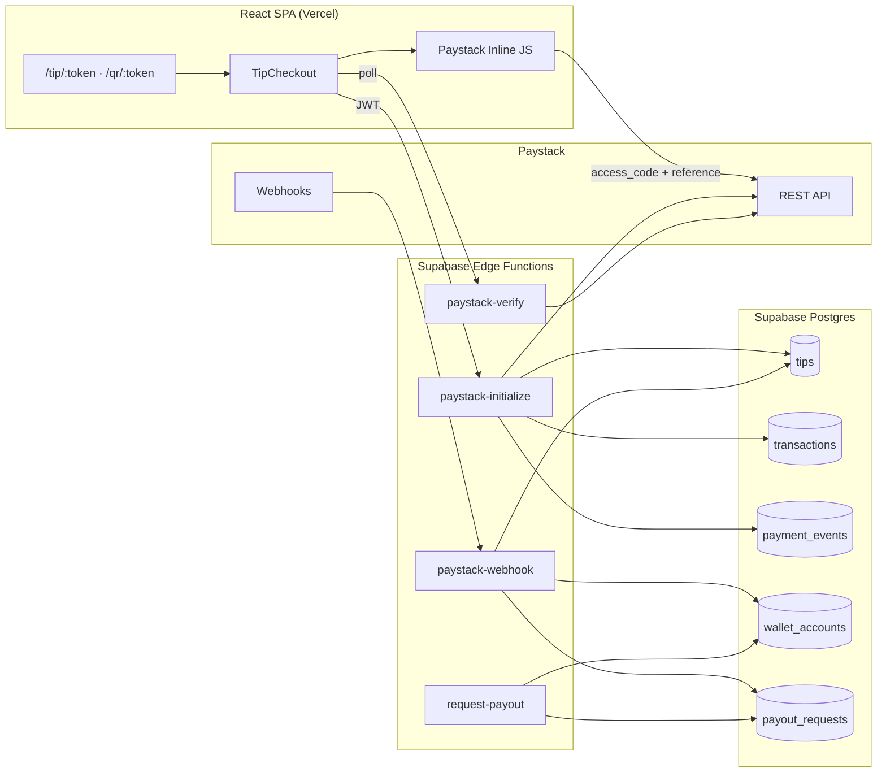

# TipGuard SA — Production architecture

Launch-ready view of Paystack → Edge Functions → Supabase → React.

## System diagram



## Payment data flow

1. **Initialize** — Authenticated client calls `paystack-initialize` with `guard_id`, `amount_cents`, optional `device_fingerprint`. Edge creates `tips` + `transactions` (pending), records `payment_events` (`init:{reference}`), calls Paystack `/transaction/initialize`, returns `access_code`.
2. **Inline checkout** — `paystackCore.ts` opens Paystack popup; user pays in ZAR.
3. **Verify (client)** — `/payment/success` polls `paystack-verify` until `succeeded` or timeout.
4. **Webhook (authoritative)** — Paystack posts `charge.success` / `charge.failed` / `transfer.*` to `paystack-webhook`. Idempotent `claim_provider_webhook_event`; `finalize_tip_from_paystack_reference` credits `wallet_accounts` net of `platform_settings.fee_bps`.
5. **Payout** — Guard calls `request-payout`; `hold_guard_payout` moves available → pending; operator processes bank transfer; `transfer.success` updates `payout_requests`.

## Environment matrix

| Variable | Where | Required |
|----------|-------|----------|
| `VITE_SUPABASE_URL` | Vite | Yes |
| `VITE_SUPABASE_ANON_KEY` | Vite | Yes |
| `VITE_PAYSTACK_PUBLIC_KEY` | Vite | Yes (tips) |
| `PAYSTACK_SECRET_KEY` | Supabase secrets | Yes |
| `SUPABASE_SERVICE_ROLE_KEY` | Supabase secrets | Yes (Edge) |
| `PUBLIC_APP_URL` | Supabase secrets | Recommended (callback URL) |

Never put `PAYSTACK_SECRET_KEY` or `SERVICE_ROLE` in Vite.

## Webhook URLs (production)

Register in Paystack Dashboard → Settings → Webhooks:

```
https://<project-ref>.supabase.co/functions/v1/paystack-webhook
```

Events: `charge.success`, `charge.failed`, `transfer.success`, `transfer.failed`, `transfer.reversed` (optional: `paymentrequest.*`).

## Deploy steps

1. **Migrations** — `supabase db push` or Dashboard SQL for `supabase/migrations/20260624140000_fintech_production_mvp.sql` and prior chain.
2. **Edge** — `supabase functions deploy paystack-initialize paystack-verify paystack-webhook request-payout`
3. **Secrets** — `supabase secrets set PAYSTACK_SECRET_KEY=... PUBLIC_APP_URL=https://your-app.vercel.app`
4. **Frontend** — Vercel env: `VITE_*` keys; redeploy after migration + Edge.

## Related docs

- [ARCHITECTURE.md](./ARCHITECTURE.md) — ERD and directory map
- [PAYSTACK_SETUP.md](./PAYSTACK_SETUP.md) — keys and test cards
- [SUPABASE_DEPLOY.md](./SUPABASE_DEPLOY.md) — CLI workflow
