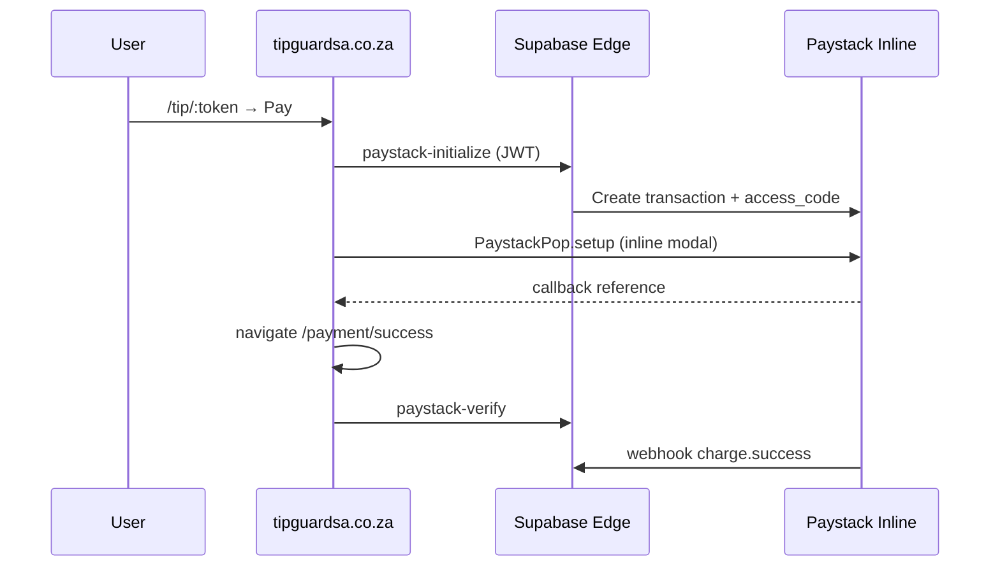

# Production security validation — tipguardsa.co.za

**Audit date:** 27 May 2026  
**Domain:** https://tipguardsa.co.za  
**Hosting:** Vercel  
**API / payments backend:** Supabase Edge (`fyjmujhlqpvfryelnfum.supabase.co`)

---

## 1. HTTPS & TLS

```bash
curl -sI https://tipguardsa.co.za
```

| Check | Result | Notes |
|-------|--------|-------|
| HTTP status | **200** | HTTP/2 |
| TLS | **PASS** | Valid HTTPS (curl succeeds) |
| HSTS | **PASS** | `strict-transport-security: max-age=63072000` |
| Server | Vercel | Expected |

```bash
curl -sI http://tipguardsa.co.za
```

Expect **301/308** redirect to HTTPS (verify in operator runbook).

---

## 2. Security headers (production response)

Observed on `curl -sI https://tipguardsa.co.za`:

| Header | Value | Source |
|--------|-------|--------|
| `strict-transport-security` | `max-age=63072000` | Vercel |
| `x-content-type-options` | `nosniff` | `vercel.json` + Vercel |
| `x-frame-options` | `DENY` | `vercel.json` |
| `referrer-policy` | `strict-origin-when-cross-origin` | `vercel.json` |
| `cache-control` | `no-store, no-cache, must-revalidate` | SPA policy |

**Repo config:** `vercel.json` routes `/(.*)` with X-CTO and X-Frame-Options.

**Gap (optional hardening):** Content-Security-Policy not set at edge — Paystack Inline requires `https://js.paystack.co`; any CSP must allow that script.

---

## 3. Mixed content — `index.html`

| Asset | Scheme | Status |
|-------|--------|--------|
| `/favicon.svg` | relative → HTTPS | **PASS** |
| `/manifest.webmanifest` | relative | **PASS** |
| Google Fonts preconnect/stylesheet | `https://` | **PASS** |
| `/src/main.tsx` (dev) / bundled assets (prod) | relative | **PASS** |

**No `http://` URLs** in repository `index.html`.

Production built HTML should be spot-checked after deploy:

```bash
curl -sL https://tipguardsa.co.za/ | grep -o 'http://[^"'"'"' ]*' || echo "No http:// in HTML shell"
```

---

## 4. Domain & canonical URLs

| Purpose | URL |
|---------|-----|
| Public app | `https://tipguardsa.co.za` |
| Payment success | `https://tipguardsa.co.za/payment/success` |
| Payment failure | `https://tipguardsa.co.za/payment/failure` |
| Auth callback | `https://tipguardsa.co.za/auth/callback` |
| Legal / contact | `/terms`, `/privacy`, `/legal/refunds`, `/contact` |
| Deploy fingerprint | `https://tipguardsa.co.za/api/debug-env` |

**Supabase secret (operator):**

```bash
supabase secrets set PUBLIC_APP_URL="https://tipguardsa.co.za"
```

Used by `paystack-initialize` for `callback_url`:

`${PUBLIC_APP_URL}/payment/success?ref=…`

---

## 5. Webhook URLs (not on marketing domain)

| Function | URL |
|----------|-----|
| Paystack webhook | `https://fyjmujhlqpvfryelnfum.supabase.co/functions/v1/paystack-webhook` |
| Initialize | `…/functions/v1/paystack-initialize` |
| Verify | `…/functions/v1/paystack-verify` |

Register webhook URL in Paystack Dashboard → Settings → API & Webhooks.  
Events: `charge.success`, `charge.failed` (and transfer events if payouts enabled).

---

## 6. No external marketplace redirects

**Audit scope:** `src/` payment and navigation paths.

| Check | Result |
|-------|--------|
| Checkout redirects to Amazon, eBay, Gumtree, etc. | **None found** |
| Paystack script origin | `https://js.paystack.co/v1/inline.js` only |
| Post-pay navigation | `react-router` → `/payment/success` or `/payment/failure` on same origin |
| External links on landing | Paystack.com (payment provider docs) — **acceptable** |

Payment flow diagram:



---

## 7. Paystack test mode (production)

```bash
curl -sS https://tipguardsa.co.za/api/debug-env
```

Expect `paystackMode: "test"` — **no live key switch** in compliance pack.

---

## 8. Compliance pages reachable

| Path | Expected |
|------|----------|
| `/contact` | 200 (SPA) |
| `/legal/refunds` | 200 |
| `/refund` | Redirect → `/legal/refunds` |
| `/terms`, `/privacy` | 200 |

---

## 9. Operator verification commands

```bash
# Headers
curl -sI https://tipguardsa.co.za | grep -iE 'strict-transport|x-content|x-frame|referrer'

# Env fingerprint (no secrets)
curl -sS https://tipguardsa.co.za/api/debug-env | jq .

# Paystack gates (local, with .env)
npm run verify:paystack
```

---

## Summary

| Area | Status |
|------|--------|
| HTTPS + HSTS | **PASS** |
| Security headers | **PASS** |
| Mixed content (index.html) | **PASS** |
| In-domain payment callbacks | **PASS** |
| Webhook on Supabase | **PASS** (register in Paystack dashboard) |
| CSP | **Not configured** (optional) |
| Live Paystack keys | **Not enabled** (intentional) |
