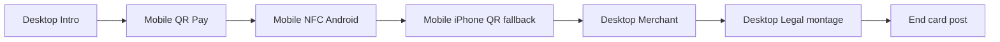

# TipGuard SA — Professional compliance demo video (production)

**Deliverable:** `assets/compliance/TipGuard_SA_Compliance_Demo_90s.mp4`  
**Target length:** 60–90 seconds (master cut: **75s**)  
**Audience:** Paystack review, compliance sign-off, investor confidence  
**Production URL (only):** https://tipguardsa.co.za  
**Demo tip URL:** https://tipguardsa.co.za/tip/demo-staging-qr-01  

**Companion docs:**

| Doc | Purpose |
|-----|---------|
| [PROFESSIONAL_DEMO_VOICEOVER.md](./PROFESSIONAL_DEMO_VOICEOVER.md) | Full narration script |
| [PROFESSIONAL_DEMO_CAPTIONS.srt](./PROFESSIONAL_DEMO_CAPTIONS.srt) | On-screen captions / SRT import |
| [PROFESSIONAL_DEMO_RECORDING_SEQUENCE.md](./PROFESSIONAL_DEMO_RECORDING_SEQUENCE.md) | Step-by-step capture order |

**Long-form reference (optional B-roll source):** [REVIEW_VIDEO_MASTER_SCRIPT.md](./REVIEW_VIDEO_MASTER_SCRIPT.md)

> **Do not commit MP4 binaries to git.** Record locally; place finished file in `assets/compliance/` or secure cloud storage per [assets/compliance/README.md](../assets/compliance/README.md).

---

## Master timeline (75s cut — expand to 90s with +2s per section)

| Timestamp | Section | Duration | Primary device |
|-----------|---------|----------|----------------|
| **0:00–0:05** | [Intro](#1-intro-000005) | 5s | Desktop 1920×1080 |
| **0:05–0:28** | [Customer QR](#2-customer-qr-005028) | 23s | Mobile portrait |
| **0:28–0:42** | [NFC / tap](#3-nfc--tap-028042) | 14s | Mobile (Android + iPhone) |
| **0:42–0:58** | [Merchant](#4-merchant-042058) | 16s | Desktop |
| **0:58–1:10** | [Security & trust](#5-security--trust-058110) | 12s | Desktop |
| **1:10–1:20** | [End screen](#6-end-screen-110120) | 10s | Desktop + post title card |

**90s variant:** Hold merchant dashboard +2s, security pages +3s, end card +5s (voiceover has alt lines in voiceover doc).

---

## 1. Intro (0:00–0:05)

**On screen:** https://tipguardsa.co.za/ — hero visible; **HTTPS padlock + full domain** in URL bar.

**Shot list:**

| # | Shot | Framing | Notes |
|---|------|---------|-------|
| 1.1 | Landing full-page | Desktop display capture | No DevTools, no `build:*` badge |
| 1.2 | URL bar close-up (optional insert) | 2s cutaway | Post-production zoom OK |

**Do not build an in-app intro animation.** Add title in editor:

- Line 1: `TipGuard SA`
- Line 2: `Digital tipping · South Africa`
- Line 3: `tipguardsa.co.za`

**Retake if:** scroll jank, lazy-load flash, or compliance badge visible (see pre-flight).

---

## 2. Customer QR (0:05–0:28)

**On screen:** https://tipguardsa.co.za/tip/demo-staging-qr-01  
(Aliases for QA only — **do not show in final cut:** `/qr/demo-staging-qr-01`, `/t/demo-staging-qr-01`)

**Shot list (mobile portrait 390×844 or native):**

| # | Time (rel.) | Action | What viewer must see |
|---|-------------|--------|----------------------|
| 2.1 | +0s | Open tip URL in Chrome/Safari | Guard name (e.g. **Nomsa Demo**), ZAR presets R10/R20/R50 |
| 2.2 | +4s | Sign in if prompted | `demo-customer@tipguard.staging` — **never** show password on screen after submit |
| 2.3 | +8s | Tap **R20** (or R10) | Amount selected, **Pay** enabled |
| 2.4 | +12s | Tap **Pay** | Brief “Creating your secure payment…” / session check — cut if &gt;3s |
| 2.5 | +16s | Paystack Inline | Modal from `js.paystack.co`; enter test card (below) |
| 2.6 | +22s | Success | `/payment/success` on **tipguardsa.co.za** with reference visible |

**Paystack test card (test mode only):**

| Field | Value |
|-------|--------|
| Number | `4084084084084081` |
| Expiry | Any future date |
| CVV | `408` |
| OTP (if prompted) | `123456` |

**Retake rules:**

- Spinner &gt;18s with no overlay → stop; check [COMPLIANCE_DEMO_STABILIZATION.md](./COMPLIANCE_DEMO_STABILIZATION.md), redeploy, retry.
- “Checkout already starting” loop → hard refresh, incognito, one retake max.
- Paystack modal fails to open → verify `VITE_PAYSTACK_PUBLIC_KEY=pk_test_…` on production.
- Wrong domain in success URL → **do not use clip**; fix env and re-record payment segment only.

---

## 3. NFC / tap (0:28–0:42)

**Narrative goal:** Tap opens **our** URL; payment path identical to QR; iOS handled honestly.

### Android Chrome (HTTPS required)

| # | Shot | Action |
|---|------|--------|
| 3.1 | Guard hub or venue NFC entry | **Scan NFC tag** (Web NFC) |
| 3.2 | Tap official tag | “Verifying link…” → lands on `https://tipguardsa.co.za/tip/demo-staging-qr-01` (or venue token) |
| 3.3 | Same tip UI | 2s hold on guard name — **cut before second full payment** if timeboxed |

**Requirements:** Physical Android, Chrome, **HTTPS** production URL on tag (NDEF: `tipguard://tip/demo-staging-qr-01` or `https://tipguardsa.co.za/tip/demo-staging-qr-01`). See [NFC_SECURITY_VALIDATION.md](./NFC_SECURITY_VALIDATION.md).

### iPhone (professional QR fallback — not a failure)

| # | Shot | Action |
|---|------|--------|
| 3.4 | Safari → guard/venue NFC panel | System message: Web NFC not supported on iPhone |
| 3.5 | Tap **Open QR tipping instead** | Same `/tip/demo-staging-qr-01` — 3s hold on tip page |

**On-screen lower-third (editor):** `iPhone: QR tipping · Same secure checkout`

**Retake if:** tag opens wrong host, freeze on “Verifying link…”, or notification banner with PII.

**Desktop substitute:** If no tag, use 3s B-roll of NFC panel + QR fallback button ([NFC_VIDEO_RECORDING_GUIDE.md](./NFC_VIDEO_RECORDING_GUIDE.md)) — label “Android tap” in captions only if real tap is included elsewhere.

---

## 4. Merchant (0:42–0:58)

**On screen:** https://tipguardsa.co.za/merchant (signed in as merchant)

**Shot list (desktop):**

| # | Shot | Action |
|---|------|--------|
| 4.1 | Dashboard overview | Today’s tips / revenue summary |
| 4.2 | Latest transaction row | Point to tip from §2 (amount + time) — refresh once if needed |
| 4.3 | Quick nav (optional) | `/merchant/qr` — copy link showing `tipguardsa.co.za/tip/…` origin |

**Credentials:** `demo-merchant@tipguard.staging` / `TipGuardDemo2026!` (after `npm run seed:demo`).

**Retake if:** infinite spinner on `/merchant` — see [COMPLIANCE_DEMO_STABILIZATION.md](./COMPLIANCE_DEMO_STABILIZATION.md).

---

## 5. Security & trust (0:58–1:10)

**On screen (rapid montage, ~3s each):**

| Page | URL |
|------|-----|
| Contact | https://tipguardsa.co.za/contact |
| Terms | https://tipguardsa.co.za/terms |
| Privacy | https://tipguardsa.co.za/privacy |
| Refunds | https://tipguardsa.co.za/legal/refunds |

**Insert (2s):** Paystack Inline still on TipGuard tab (reuse freeze-frame from §2.5 if needed).

**Voiceover covers (no secrets on camera):**

- HTTPS on `tipguardsa.co.za`
- Card data via Paystack Inline — not stored by TipGuard
- Webhook settlement on backend (no `sk_`, no Supabase dashboard)

---

## 6. End screen (1:10–1:20)

**On screen:** Return to landing or merchant dashboard; fade to title card.

**Post-production end card (editor):**

```
TipGuard SA
tipguardsa.co.za
Paystack test mode · Production-ready architecture
```

Optional CTA: `Contact · Terms · Privacy` (footer icons only).

---

## Camera flow summary



| Track | Resolution | FPS | Audio |
|-------|------------|-----|-------|
| Desktop (OBS / Display Capture) | 1920×1080 | 30 | Room tone off; VO in post |
| Mobile (screen record) | 390×844 min or native | 30 | Do Not Disturb; hide notifications |

**Transitions (post):** Hard cut or **0.3s** cross-dissolve; no wipes. No debug UI, no mouse trail plugins.

---

## Best scenes to record (priority)

1. **Money shot:** Mobile QR → Paystack → `/payment/success` on tipguardsa.co.za  
2. **Trust shot:** Merchant row matching that payment  
3. **Differentiation:** Android NFC tap → same tip URL  
4. **Honesty shot:** iPhone QR fallback (3s)  
5. **Compliance shot:** Contact page business details visible  

---

## Pre-flight checklist (mandatory)

### Deploy & env

- [ ] Production: https://tipguardsa.co.za loads (200)
- [ ] `VITE_COMPLIANCE_DEMO_MODE=true` — hides Paystack test banner + `build:*` badge ([complianceDemo.ts](../src/lib/complianceDemo.ts))
- [ ] `VITE_PAYSTACK_PUBLIC_KEY=pk_test_…` (test charges only)
- [ ] `VITE_TIPGUARD_VERBOSE` **unset** or `false` on production
- [ ] `npm run seed:demo` (or confirm demo accounts + `demo-staging-qr-01` active)
- [ ] `npm run verify:supabase` — PASS

### Accounts & data

- [ ] Customer: `demo-customer@tipguard.staging` / `TipGuardDemo2026!`
- [ ] Merchant: `demo-merchant@tipguard.staging` / same password
- [ ] Demo QR: https://tipguardsa.co.za/tip/demo-staging-qr-01 resolves guard name

### Recording hygiene

- [ ] Close DevTools on all devices
- [ ] Incognito or dedicated demo profile; clipboard cleared
- [ ] No passwords visible after login
- [ ] Do Not Disturb / Focus on phones
- [ ] OBS: Display or Window capture showing URL bar
- [ ] Test record 10s → playback in VLC — no dropped frames

### NFC (if segment included)

- [ ] Android Chrome latest, HTTPS only
- [ ] Tag programmed to TipGuard token (see [NFC_SECURITY_VALIDATION.md](./NFC_SECURITY_VALIDATION.md))
- [ ] iPhone clip planned as QR fallback (not fake NFC)

---

## Post-production notes

| Item | Guidance |
|------|----------|
| **Music** | Optional — royalty-free, low BPM (e.g. Artlist “Corporate Light”, Pixabay “Soft Technology”, or YouTube Audio Library “Ambient”). Duck −12dB under VO. |
| **Transitions** | 0.3s cuts or dissolves; no star wipes |
| **Colour** | Light grade only; preserve readable URL bar |
| **Blur** | Any accidental email/phone; test card number OK per Paystack test mode |
| **Export** | H.264 MP4, 1920×1080 master; compress &lt;50 MB for email if needed |
| **Filename** | `TipGuard_SA_Compliance_Demo_90s.mp4` |
| **Intro/end** | Title cards in **DaVinci Resolve / Final Cut / CapCut** — not in-app |

---

## Related

- [COMPLIANCE_DEMO_STABILIZATION.md](./COMPLIANCE_DEMO_STABILIZATION.md)
- [PAYSTACK_REVIEW_DEMO.md](./PAYSTACK_REVIEW_DEMO.md)
- [FREEZE_AUDIT_CHECKLIST.md](./FREEZE_AUDIT_CHECKLIST.md)
