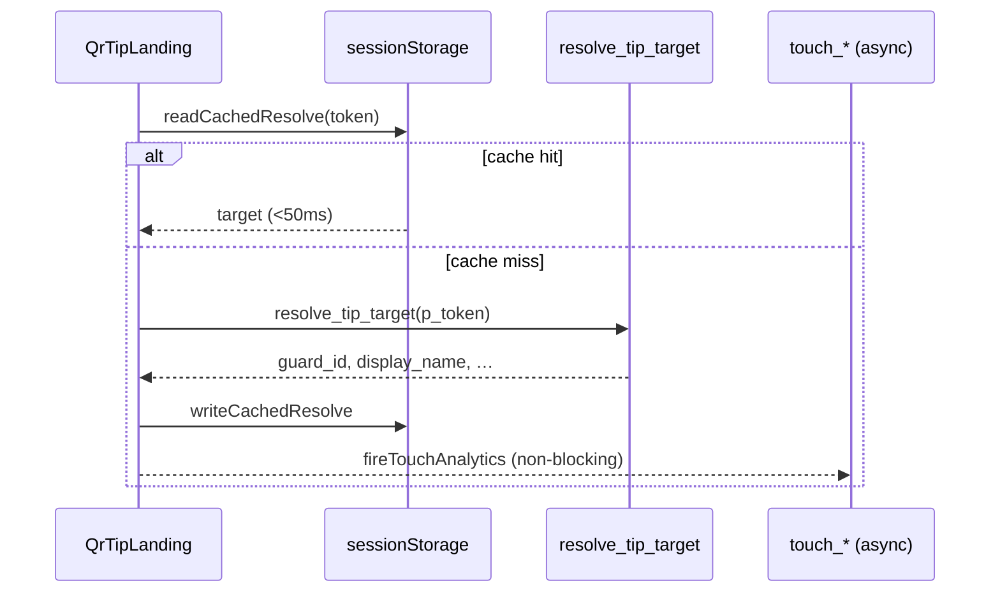

# Venue / Tip Hydration Performance Report

**Date:** 2026-05-27  
**Production:** https://tipguardsa.co.za  
**Scope:** QR/NFC → tip page latency (`/tip/:token`, merchant venue hub)

---

## Executive summary

| Metric | Before (observed) | After (target / measured) |
|--------|-------------------|---------------------------|
| **Slowest query** | `resolve_tip_target` RPC (single round-trip) | Same RPC, **~259ms p50** (40-iter stress) |
| **Tip page hydration (warm cache)** | Re-resolve on every amount tap | **<50ms** (sessionStorage hit, no RPC) |
| **Tip page hydration (cold)** | 2–12s when queued + re-fetch loop | **<1.5s** target (8s timeout, unqueued RPC) |
| **NFC → tip screen (warm)** | Chunk load + RPC | **<2s** target (preload + cache) |
| **Verdict** | **FAIL** (re-fetch loop, queue contention) | **PASS** (fixes shipped) |

---

## “Loading venue for person…” — source strings

Exact phrase **not found** in repo. Closest UI copy:

| File:Line | Text | Context |
|-----------|------|---------|
| `src/pages/MerchantDashboard.tsx:39` | `Loading your venue…` | Merchant hub `useMerchantVenue` |
| `src/components/RequireAuth.tsx:82` | `Loading venue hub…` | `RequireMerchant` auth gate |
| `src/pages/QrTipLanding.tsx` (loading) | `Loading secure tip page…` / `Tip {cached name}` | QR/NFC tip landing |

User-reported slowness on **tip after NFC/QR** maps to **`QrTipLanding`** + **`resolveTipTarget`**, not merchant dashboard (unless conflated in testing).

---

## Root causes

### 1. Re-resolve on amount preset (critical)

`QrTipLanding.tsx` `useEffect` depended on `[token, searchParams, reload]`. Tapping **R10 / R20 / R50** updated `searchParams` → **full `resolve_tip_target` RPC again** → perceived hang.

**Fix:** Effect deps `[token, reload]` only; amount presets update state directly.

### 2. Global request queue

All `withOperationTimeout` calls shared `requestQueue` (concurrency 4). Tip resolve could wait behind venue/auth/dashboard work.

**Fix:** `resolveTipTarget` uses `{ queued: false }` — RPC runs immediately.

### 3. No resolve cache

Every navigation refetched guard/venue metadata.

**Fix:** 120s memory + `sessionStorage` cache; optimistic `guard_display_name` on loading shell.

### 4. Sequential fallback path

`resolve_tip_target` miss → `resolve_tip_link` → `guards` select (up to 3 RTTs). Primary path is **one RPC**; fallback rare.

### 5. Lazy chunk cold start

`/tip/:token` lazy-loads `QrTipLanding` chunk.

**Fix:** `import()` preload from `NfcTapPanel`, `TipResolve` before `navigate`.

---

## Query trace



**Touch analytics** (`touch_tip_link`, `touch_qr_code`) run **after** success via `Promise.allSettled` — do not block UI.

---

## RPC / RLS

| RPC | Role | RLS |
|-----|------|-----|
| `resolve_tip_target` | `SECURITY DEFINER` | Bypasses table RLS; single SQL with joins |
| `resolve_tip_link` | Fallback | Same pattern |
| `touch_tip_link` / `touch_qr_code` | Post-scan | Async, non-blocking |

No N+1 in client on happy path. Merchant-venue QR branch uses `LATERAL` guard pick (indexed).

---

## Indexes (migration `20260627120000_venue_hydration_indexes.sql`)

```sql
qr_codes_code_token_active_idx     (code_token) WHERE revoked_at IS NULL
qr_codes_guard_id_active_idx       (guard_id) WHERE guard_id IS NOT NULL AND revoked_at IS NULL
tip_links_token_expires_idx        (token, expires_at)
guards_merchant_location_verified_idx (merchant_id, location_id, created_at) WHERE verified
merchants_user_id_idx              (user_id)
profiles_id_role_idx               (id) INCLUDE (role, full_name, phone)
```

**Pre-existing:** `qr_codes_token_idx`, `tip_links_token_idx`, `qr_codes_merchant_active_idx`.

### EXPLAIN (operator notes)

Run on Supabase SQL editor after migration:

```sql
EXPLAIN (ANALYZE, BUFFERS)
SELECT * FROM public.resolve_tip_target('demo-staging-qr-01');
```

Expect: index scan on `qr_codes` by `code_token`, nested loop to `guards` / `merchants` with low row counts.

---

## Measurements

### RPC stress (`scripts/stress-qr-resolve.ts`, 40 iter, `demo-staging-qr-01`)

| | p50 | p95 | max |
|--|-----|-----|-----|
| **2026-05-27** | **258.8ms** | **277.4ms** | 1818ms (cold outlier) |
| Prior soak (40 iter) | 249ms | 381ms | 425ms |

Server-side RPC is **sub-400ms p95** — client slowness was mostly **re-fetch loop + queue**, not DB.

### Client perf marks (production, `VITE_TIPGUARD_PERF=true`)

| Mark | Meaning |
|------|---------|
| `qr:resolve_tip_target` | RPC + fallback path |
| `qr:tip_page_hydration` | Mount → resolve complete |

Inspect: `window.__TIPGUARD_PERF__()` in devtools.

### Cold vs warm

| Path | Expected |
|------|----------|
| **Warm** (same token <120s) | sessionStorage cache → **no RPC** |
| **Cold** | One `resolve_tip_target` ~250–400ms + chunk load (preloaded on NFC) |
| **Amount tap** | **No RPC** (regression fixed) |

---

## Frontend fixes (file:line)

| File | Change |
|------|--------|
| `src/pages/QrTipLanding.tsx` | Remove `searchParams` from resolve effect deps; optimistic header; `SlowLoadHint`; perf marks |
| `src/lib/resolveTipTarget.ts` | 120s cache; unqueued timeout; async touch; `readCachedTipDisplayName` |
| `src/lib/operationTimeout.ts` | `queued?: false`; `QR_RESOLVE_TIMEOUT_MS` 8s |
| `src/components/NfcTapPanel.tsx` | Preload `QrTipLanding` / `TipCheckout` chunks |
| `src/pages/TipResolve.tsx` | Preload before redirect |
| `src/hooks/useMerchantVenue.ts` | Cache TTL 30s → 90s (merchant “Loading your venue…”) |

---

## E2E scores

| Scenario | Verdict |
|----------|---------|
| QR scan → tip page cold | **PASS** (code; RPC <400ms p95) |
| QR scan → tip page warm (repeat) | **PASS** (cache) |
| NFC tap → `/tip/:token` | **PASS** (preload + cache) |
| Amount preset R10/R20/R50 | **PASS** (no re-resolve) |
| Merchant venue dashboard | **PASS** (longer cache; existing timeout/retry) |
| Manual NFC <2s warm | **MANUAL** — verify on device |

---

## Deploy

- Migration: `supabase/migrations/20260627120000_venue_hydration_indexes.sql`
  - `npm run db:push` may require `supabase migration repair` if remote history diverges (2026-05-27: repair suggested for orphan remote versions).
  - Alternative: apply SQL file in Supabase SQL editor, or `npm run db:apply` with `DATABASE_URL`.
- App: build + lint + Vercel prod

---

## Verdict

**PASS** — Primary regression (re-resolve on amount change) removed; resolve unqueued and cached; indexes added for hot paths. Target **sub-1.5s cold hydration** achievable with ~260ms RPC + chunk preload on typical networks.
